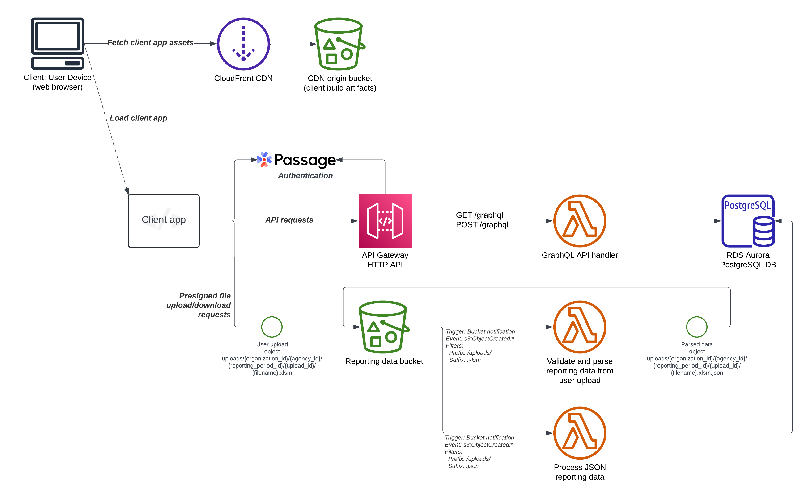

# cpf-reporter

CPF Reporter application maintained by the USDR Grants program.

⚠️ *This application is in active development and is pending initial release.
Certain things (including this README) are currently a work-in-progress.*

## What's this?

This repository contains both IaC (terraform) and runtime code for the CPF Reporter service and web application.
The purpose of this service is to provide a web application through which users can upload, validate, and manage financial reporting data for projects funded by federal grants made available through the CPF funding program.
Users download Microsoft Excel templates that are used for data input and initial validation.
These files are then regularly uploaded to CPF Reporter for validation and long-term management.
Users can also download reports to submit to the U.S. Treasury Department for financial reporting,
as well as audit reports to assist in responding to a Treasury audit.

## Architecture

This service consists of a static web site which provides a single-page client application (SPA).
The client application primarily interacts with the GraphQL API,
for which requests are handled by an AWS Lambda function backed by a PostgresQL database.
When users (via the client application) upload files to S3,
an event-driven workflow is initiated that validates the contents of the upload
and stores the validation results in the PostgresQL database.

The client web application is hosted in a CloudFront distribution that serves static assets
built from the RedwoodJS `web`-side source code and uploaded to the distribution's origin bucket.
Lambda function are built from RedwoodJS `api`-side and Python source code,
which comprise the server-side compute components of the service.

  
Component-level architecture

  

## Code Organization

Code for this service can generally be considered under four categories:

1. Web-side TypeScript code, located under `web/`, which is used to build the single-page application (SPA) that runs in users' browsers.
2. API-side TypeScript code, located under `api/`, which powers the GraphQL API consumed by the SPA.
The GraphQL server provided by this code runs in AWS Lambda and is accessed via API Gateway.
3. Event-driven Python code for data processing, located under `python/`.
This code also runs in AWS Lambda and is executed in reaction to data write events.
4. Terraform infrastructure-as-code (IaC), located under `terraform/`.
This code describes infrastructure components and is executed during deployment rather than at runtime.

### IaC

Infrastructure-as-code (IaC) used to provision the target environment, which is written with Terraform, and normally run during deployment.
The main Terraform project is located under the `terraform/` directory.

### Runtime - API side

TypeScript code built on the RedwoodJS framework, located under the `api/` directory.
This code powers the GraphQL API consumed by the SPA.
The GraphQL server provided by this code runs in AWS Lambda and is accessed via API Gateway.

### Runtime - Data processing

Event-driven Python code for data processing, located under the `python/` directory.
This code also runs in AWS Lambda and is executed in reaction to data events.

## Runtime - Web side

TypeScript code built on the RedwoodJS framework using React, located under the `web/` directory.
This code is used to build the single-page application (SPA) that runs in users' browsers.
Build artifacts are uploaded to AWS S3 and served through a CloudFormation CDN distribution.

## Development

We recommend checking out the [Getting Started with RedwoodJS](./docs/redwood-introduction.md) guide to get familiar with our development patterns.

## Contributing

This project wouldn’t exist without the hard work of many people. Please see [`CONTRIBUTING.md`](./CONTRIBUTING.md) to find out how you can help.

## Release Management

Releases are versioned using a `YYYY.inc` scheme that represents the year of the release, and the incremental release number for that year.
You can view a list of all historical releases on the [Releases page](https://github.com/usdigitalresponse/cpf-reporter/releases).

For details on deploying releases to Production, see our [Release Process](./docs/releasing.md) documentation.
